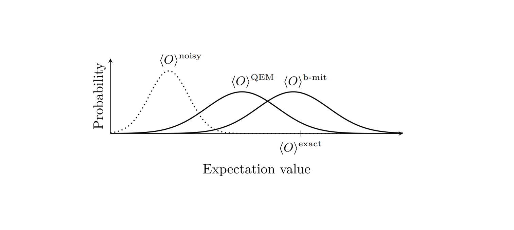
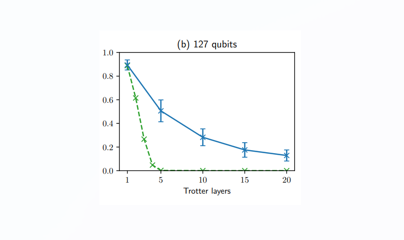
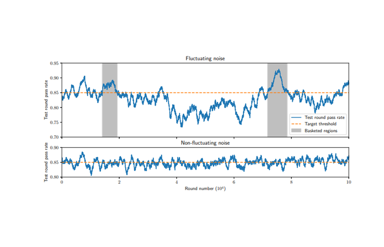
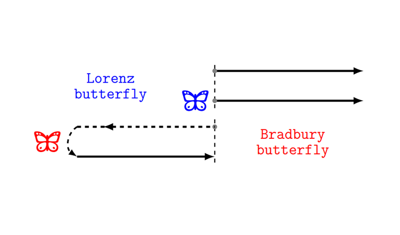

# Publications

    

        
    

    

        <h3 class="publication-title">
            <a href="https://arxiv.org/abs/2603.10224" class="publication-link">
                Reducing Quantum Error Mitigation Bias Using Verifiable Benchmark Circuits
            </a>
        </h3>
        
arXiv:2603.10224

        
Joseph Harris, Kevin Lively, Peter K Schuhmacher

        
2026

        

            <a href="https://arxiv.org/abs/2603.10224" class="tag tag-arxiv">Paper</a>
            <a href="https://github.com/joeharrisuk/qem-bias-mitigation" class="tag tag-github">GITHUB</a>
        

    

    

        
    

    

        <h3 class="publication-title">
            <a href="https://arxiv.org/abs/2410.01505" class="publication-link">
                Application-Aware Benchmarking on NISQ Hardware using Expectation Value Fidelities
            </a>
        </h3>
        
arXiv:2410.01505

        
Joseph Harris, Peter K Schuhmacher

        
2025

        

            <a href="https://arxiv.org/abs/2410.01505" class="tag tag-arxiv">Paper</a>
        

    

    

        
    

    

        <h3 class="publication-title">
            <a href="https://journals.aps.org/pra/abstract/10.1103/PhysRevA.111.022602" class="publication-link">
                Error mitigation of BQP computations using measurement-based verification
            </a>
        </h3>
        
Physical Review A

        
Joseph Harris, Elham Kashefi

        

            <a href="https://journals.aps.org/pra/abstract/10.1103/PhysRevA.111.022602" class="tag tag-arxiv">Paper</a>
            <a href="https://github.com/joeharrisuk/BQP-QEM" class="tag tag-github">GITHUB</a>
        

    

    

        
    

    

        <h3 class="publication-title">
            <a href="https://journals.aps.org/prl/abstract/10.1103/PhysRevLett.129.050602" class="publication-link">
                Benchmarking information scrambling
            </a>
        </h3>
        
Physical Review Letters

        
Joseph Harris, Bin Yan, Nikolai A Sinitsyn

        
2025

        

            <a href="https://journals.aps.org/prl/abstract/10.1103/PhysRevLett.129.050602" class="tag tag-arxiv">Paper</a>
        

    

